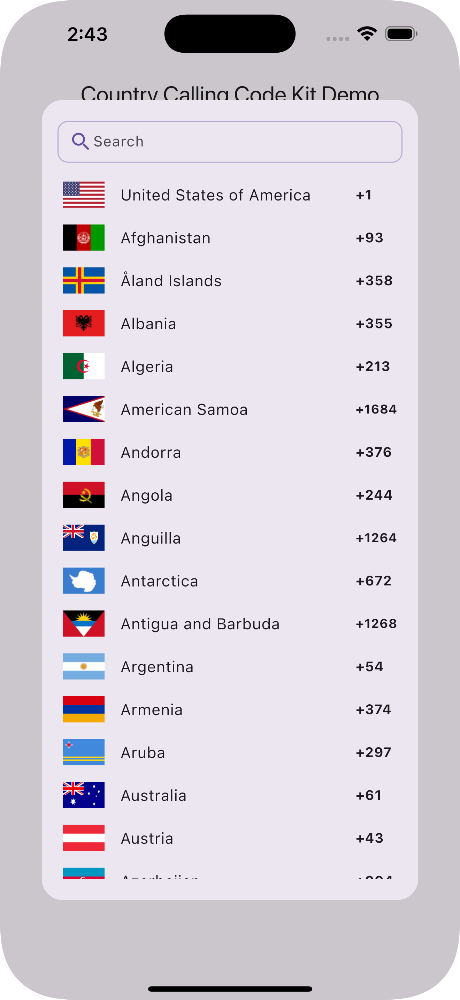

# Country Calling Code Kit

### 📞 Country Code Picker – With Style!

Tired of boring dropdowns and confusing country pickers? Say hello to your new favorite Flutter package, the ultimate
toolkit for selecting country calling codes with flair! 🌍✨





## 💡 Features You'll Love

- **Tap & Pick** – Whether it’s a slick bottom sheet or a classic dialog, users can choose countries faster than you can
  say “international roaming.”
- **Smart by Default** – Automatically detects the default country based on your device settings. Less thinking, more
  doing.
- **Flag it Up** – Beautifully displays country flags, names, and dialing codes in a clean and classy UI.
- **Platform Party** – Android, iOS, Web, macOS, Linux, Windows – this package supports them all.
- **Make it Yours** – Fully customizable UI components to match your app’s vibe.

From Argentina 🇦🇷 to Zimbabwe 🇿🇼, your users can connect globally with a single tap. It’s fast, intuitive, and actually
fun to use.

### **Show some ❤️ and ⭐️ the Repo**

Resources:

- [GitHub Repo](https://github.com/yashas-hm/country-calling-code-kit)
- [Example](https://github.com/yashas-hm/country-calling-code-kit/tree/main/example)
- [Pub Package](https://pub.dev/packages/country_calling_code_kit)

## Usage

### Import the package

```dart
import 'package:country_calling_code_kit/country_calling_code_kit.dart';
```

### Get the default country (based on device settings)

```dart

Country? country = await

getDefaultCountry();
```

### Show country picker dialog

```dart

Country? selectedCountry = await
showCountryPickerDialog
(
context: context);
if (selectedCountry != null) {
// Use the selected country
print('Selected country: ${selectedCountry.name}');
print('Country code: ${selectedCountry.countryCode}');
print('Calling code: ${selectedCountry.callCode}');
}
```

### Show a country picker bottom sheet

```dart

Country? selectedCountry = await
showCountryPickerModalSheet
(
context: context);
if (selectedCountry != null) {
// Use the selected country
print('Selected country: ${selectedCountry.name}');
print('Country code: ${selectedCountry.countryCode}');
print('Calling code: ${selectedCountry.callCode}');
}
```

### Display a country flag

```dart
Image.asset
(
country.flag,
width: 32,
height: 32,
package
:
'
country_calling_code_kit
'
,
)
```

## Example

See the `/example` folder for a complete example app.

```dart
import 'package:country_calling_code_kit/country_calling_code_kit.dart';
import 'package:flutter/material.dart';

class CountryPickerDemo extends StatefulWidget {
  @override
  _CountryPickerDemoState createState() => _CountryPickerDemoState();
}

class _CountryPickerDemoState extends State<CountryPickerDemo> {
  Country? country;

  @override
  void initState() {
    super.initState();
    initCountry();
  }

  void initCountry() async {
    country = await getDefaultCountry() ?? countries.first;
    setState(() {});
  }

  @override
  Widget build(BuildContext context) {
    return Scaffold(
      appBar: AppBar(title: Text('Country Picker Demo')),
      body: Center(
        child: Column(
          mainAxisAlignment: MainAxisAlignment.center,
          children: [
            if (country != null) ...[
              Image.asset(
                country!.flag,
                width: 100,
                height: 60,
              ),
              SizedBox(height: 16),
              Text('Name: ${country!.name}'),
              Text('Code: ${country!.countryCode.toString().toUpperCase()}'),
              Text('Call Code: ${country!.callCode}'),
              SizedBox(height: 24),
            ],
            ElevatedButton(
              onPressed: () async {
                final selectedCountry = await showCountryPickerDialog(context: context);
                if (selectedCountry != null) {
                  setState(() {
                    country = selectedCountry;
                  });
                }
              },
              child: Text('Select Country'),
            ),
          ],
        ),
      ),
    );
  }
}
```

## Credits

This package is inspired by and gives credit
to [country_calling_code_picker](https://pub.dev/packages/country_calling_code_picker).

## Contributions

- [Fork it](https://github.com/yashas-hm/country-calling-code-kit/fork) on GitHub
- [Submit](https://github.com/yashas-hm/country-calling-code-kit/issues/new/choose) feedback or bug report
